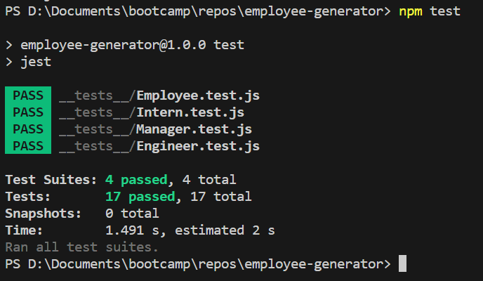

# Employee Generator
## **Description**
 Console-based employee generator that generates html to display a website based on the user input

## **Table of Contents**

* Description
* Installation Instructions
* Usage
* License
* Tests
## **Installation Instructions**
* First, you need to download the repository. After that, right click on the index.js and open it in a dedicated terminal. From there type the following commands into your console:
```
npm install
```
* After the installation is complete, you should see the following in your console:


* Verify that the "node_modules" folder now exists in your files.

* Before using the program, delete any files that already exist with the name "README.md".

## **Usage**
* Type the following into your dedicated console:
```
node index.js
```
* After that, follow the instructions on your console to create your readme file.

## **License**
Using license: MIT License

## **Tests**
To test this program, type the following into your console:
```
npm test
```
This should produce an output that looks like the following:
